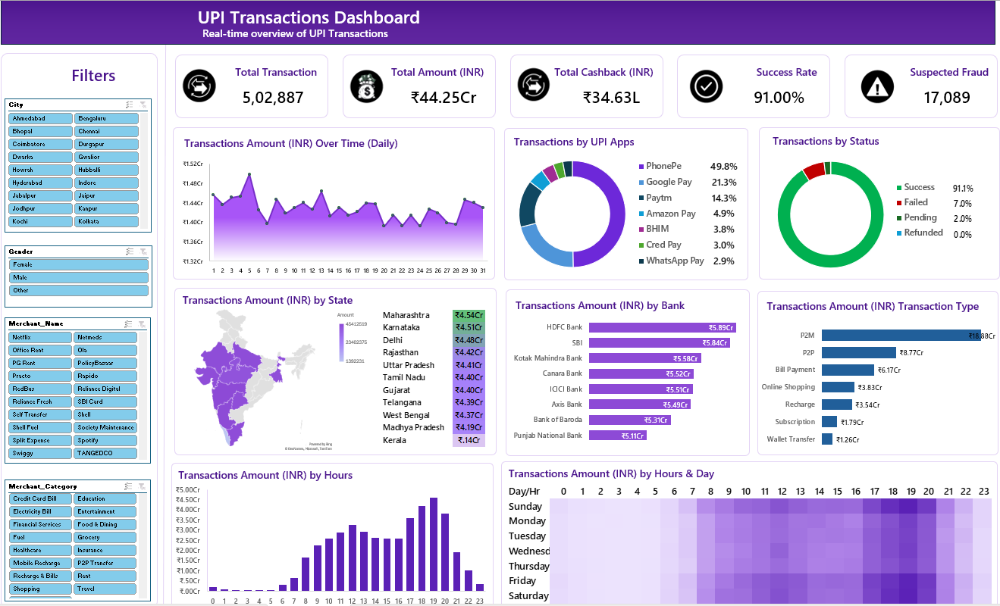

# UPI_Transactions_Dashboard_Analysis
An interactive Excel dashboard that analyzes UPI (Unified Payments Interface) transaction data to uncover patterns in payment behavior, app usage, fraud indicators, and regional/temporal trends across India.

## Summary

This project visualizes over 5 lakh UPI transactions worth ₹44.25 Cr, built entirely in Microsoft Excel using PivotTables, PivotCharts, slicers, and a Filled Map visual. It gives a real-time, filterable view into how Indians transact using UPI tracking transaction volume, success/failure rates, cashback disbursed, and suspected fraud, while breaking the data down by UPI app, bank, state, merchant category, transaction type, and time of day.

## Introduction

UPI has become the backbone of digital payments in India, processing billions of transactions across banks, apps, and merchant categories. With this scale comes the need for continuous monitoring of transaction success rates, fraud signals, cashback spend, and adoption trends across geographies and demographics.

This dashboard was built to simulate a real-world UPI transactions monitoring system entirely within Excel, combining KPI cards with deep-dive visual analysis. It answers questions like:

Which UPI apps and banks dominate transaction volume?
What times of day/week see the highest transaction activity?
How do transaction volumes vary by state?
What's the split between P2P, P2M, bill payments, and other transaction types?
What is the overall transaction success rate, and how much is flagged as suspicious?
Dataset
Volume: 5,02,887 transactions

## Tools & Tech Stack
Microsoft Excel — dashboard design and layout
PivotTables & PivotCharts — aggregations behind every visual
Slicers — interactive filters (City, Gender, Merchant Name, Merchant Category)
Filled Map (3D Map / Excel Maps) — state-wise transaction visualization
Power Query — data cleaning and transformation (if used — update as applicable)
Formulas (SUMIFS, COUNTIFS, GETPIVOTDATA, etc.) — KPI cards
Conditional Formatting — heatmap (Transactions by Hours & Day)
Key Metrics (KPI Cards)
Metric	Value
Total Transactions	5,02,887
Total Amount	₹44.25 Cr
Total Cashback	₹34.63 L
Success Rate	91.00%
Suspected Fraud (flagged transactions)	17,089

## Dashboard Features
1. Filters Panel (Slicers)

Slice the entire dashboard by:

City (Ahmedabad, Bengaluru, Chennai, Mumbai, etc.)
Gender (Male / Female / Other)
Merchant Name (Netflix, Swiggy, Spotify, SBI Card, etc.)
Merchant Category (Food & Dining, Recharge & Bills, Shopping, Travel, etc.)
2. Transactions Amount Over Time (Daily)

An area chart tracking daily transaction value across the month, highlighting spikes and dips in payment activity.

3. Transactions by UPI Apps

Donut chart showing market share by app:

PhonePe: 49.8%
Google Pay: 21.3%
Paytm: 14.3%
Amazon Pay: 4.9%
BHIM: 3.8%
Cred Pay: 3.0%
WhatsApp Pay: 2.9%
4. Transactions by Status

## Breakdown of transaction outcomes:

Success: 91.1%
Failed: 7.0%
Pending: 2.0%
Refunded: 0.0%
5. Transactions Amount by State

Filled map + ranked list of transaction value by state, led by Maharashtra (₹4.54 Cr), Karnataka (₹4.51 Cr), and Delhi (₹4.48 Cr), down to Kerala (₹0.14 Cr).

6. Transactions Amount by Bank

Horizontal bar chart comparing transaction value across issuing banks HDFC Bank leads (₹5.89 Cr), followed by SBI, Kotak Mahindra, Canara, ICICI, Axis, Bank of Baroda, and Punjab National Bank.

7. Transactions Amount by Transaction Type

Split across P2M (₹18.88 Cr), P2P (₹8.77 Cr), Bill Payment (₹6.17 Cr), Online Shopping (₹3.83 Cr), Recharge (₹3.54 Cr), Subscription (₹1.79 Cr), and Wallet Transfer (₹1.26 Cr) showing merchant payments dominate UPI usage.

8. Transactions Amount by Hours

Bar chart revealing peak activity hours, with usage building through the afternoon and peaking in the evening (5–8 PM window).

9. Transactions Amount by Hours & Day (Heatmap)

A conditional-formatting-based day-vs-hour heatmap pinpointing the exact windows (day + hour combinations) with the highest transaction value useful for identifying peak-load periods for infrastructure or fraud-monitoring planning.

## Key Insights
PhonePe dominates the UPI app market with nearly half of all transaction share, followed by Google Pay and Paytm.

P2M (Person-to-Merchant) transactions account for the largest share of transaction value, more than double P2P transfers reflecting UPI's growing role in everyday retail/merchant payments.

91% success rate indicates a generally healthy transaction pipeline, though the ~7% failure rate is worth deeper root-cause analysis (bank-side vs. app-side failures).

Maharashtra, Karnataka, and Delhi are the top revenue-generating states, aligning with urban digital payment adoption.

Transaction activity is concentrated in evening hours, suggesting most UPI usage happens post-work hours relevant for scaling server capacity and fraud-detection sensitivity during peak windows.

Bank-wise transaction values are fairly evenly distributed among top private and public sector banks (HDFC, SBI, Kotak, Canara, ICICI), indicating broad-based UPI adoption rather than dependency on a single bank.

Around 3.4% of all transactions (17,089) are flagged as suspected fraud a meaningful share worth monitoring closely alongside the 7% failure rate to distinguish genuine fraud from routine failed payments.

##  Summary Dashboard
## 📊 Dashboard Preview

## Author
Shivam Maurya

